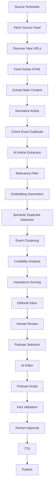
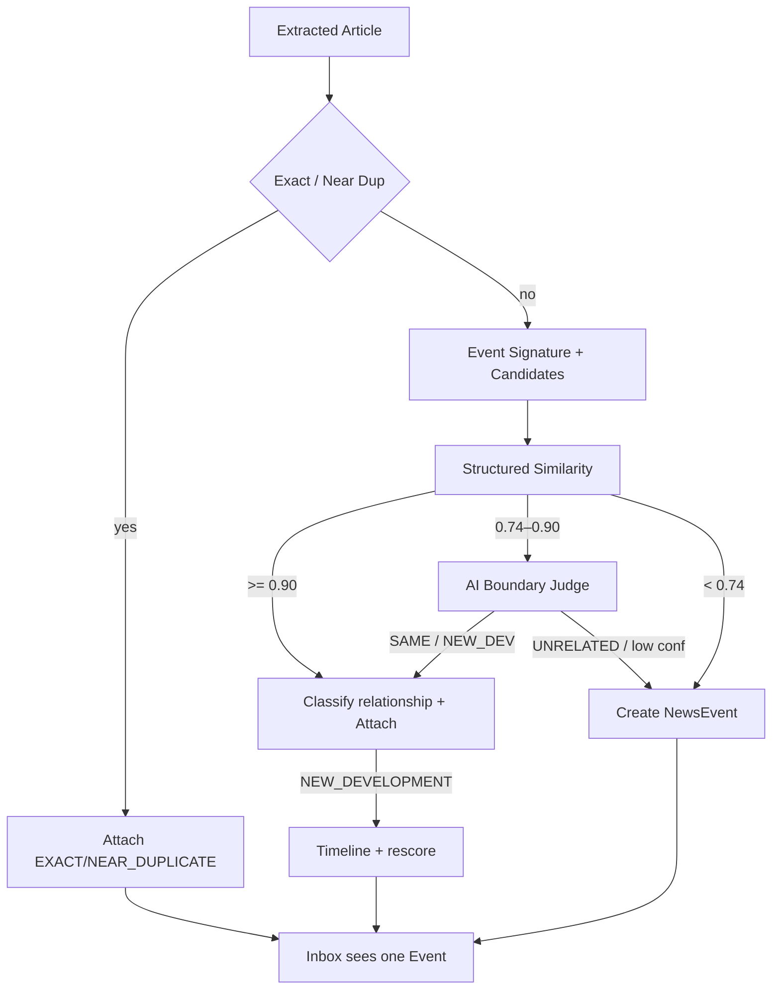

# معماری فنی — Football Newsroom

## ۱. سبک معماری

**Modular Monolith** با مرزهای ماژول واضح برای استخراج آینده به Microservice.

نسخه اول microservice کامل نیست.

## ۲. تصمیم تکنولوژی

| لایه | انتخاب | دلیل |
|------|--------|------|
| Web | Next.js (App Router) + TS + Tailwind + shadcn + TanStack Query + Zustand + PWA | Mobile-first، RTL، اکوسیستم mature |
| API | NestJS + REST + Swagger | ساختار ماژولار، DI، مناسب enterprise |
| ORM | **Sequelize** | ترجیح پروژه؛ migrations رسمی؛ کنترل SQL |
| DB | PostgreSQL (+ pgvector در فازهای بعدی) | قابلیت اطمینان + جستجوی معنایی آینده |
| Queue | BullMQ + Redis | Retry، priority، concurrency، DLQ |
| Infra | Docker Compose، Nginx (بعداً)، S3-compatible | توسعه و استقرار یکسان |
| Monorepo | pnpm workspaces | اشتراک types و packages |

جزئیات تصمیم: `DECISIONS/ADR-001-architecture.md`

## ۳. ساختار پوشه‌ها

```text
apps/
  web/          # Next.js PWA
  api/          # NestJS REST API
  worker/       # BullMQ consumers (pipeline, AI, TTS)
  crawler/      # Source fetch & discovery jobs
packages/
  shared/       # enums, DTOs shared, constants
  database/     # Sequelize models, migrations, seeders
  ai/           # Provider abstraction, mock
  editorial-rules/
  validation/
  logger/
  config/
  ui/           # shared UI primitives (optional in phase 0)
infra/
  docker/
docs/
```

## ۴. مرز سرویس‌ها (process)

| Process | مسئولیت |
|---------|----------|
| `web` | UI سردبیر، داشبورد، تنظیمات |
| `api` | AuthZ/N، CRUD، workflow، orchestration سبک |
| `crawler` | RSS/Sitemap/list، discover URL، fetch HTML، rate limit |
| `worker` | parse، AI extract، embed، dedup، cluster، score، script، TTS، notify |

ارتباط: API و scheduler کار را به Redis/BullMQ می‌فرستند؛ crawler و worker مصرف می‌کنند.

## ۵. جریان پردازش خبر



## ۶. مدل Queue

| Queue | Producer | Consumer |
|-------|----------|----------|
| `crawl-source` | Scheduler/API | crawler |
| `fetch-article` | crawler | crawler/worker |
| `parse-article` | crawler | worker |
| `extract-article` | worker | worker |
| `generate-embedding` | worker | worker |
| `detect-duplicate` | worker | worker |
| `cluster-event` | worker | worker |
| `score-event` | worker | worker |
| `verify-event` | worker | worker |
| `generate-podcast` | api | worker |
| `fact-check-script` | worker | worker |
| `generate-audio` | api/worker | worker |
| `publish-episode` | api | worker |
| `send-notification` | any | worker |
| `cleanup` | scheduler | worker |

ویژگی‌ها: Retry، Exponential Backoff، DLQ، Idempotency key، Timeout، Priority، Concurrency limit، Logs، Manual retry، Cancel.

## ۶٫۱. Clustering v2 (خلاصه)



جزئیات: `ADR-003-news-deduplication.md`، `CLUSTERING_EVALUATION.md` و `@footcast/event-clustering`.

ابزار PR-B: Decision Log پایدار، UI ارزیابی `/admin/clustering-evaluation`، Metrics، Alias سبک، Merge/Split دستی با Audit، AI Judge پشت `CLUSTER_AI_JUDGE_ENABLED`.

## ۷. لایه AI

نگاه کنید به `AI_PIPELINE.md` و `ADR-002`.

اصول:

- مدل ارزان برای extraction انبوه
- مدل میان‌رده برای event merge/conflict
- مدل گران فقط editorial روی کارت‌های خلاصه
- Provider abstraction + Mock
- Prompt versioning در DB

## ۸. امنیت (خلاصه)

JWT access + refresh rotation، RBAC، rate limit، validation، helmet، CORS، رمزنگاری API key، عدم ارسال کلید به frontend، audit log. جزئیات: `SECURITY.md`.

## ۹. Observability (خلاصه)

Structured JSON logs، request/job/trace id، health/ready/live/metrics، queue dashboard، token/cost/latency. جزئیات: `OBSERVABILITY.md`.

## ۱۰. استاندارد پاسخ API

```json
{
  "success": true,
  "data": {},
  "meta": { "page": 1, "pageSize": 20, "total": 0 },
  "error": null,
  "requestId": "uuid"
}
```

## ۱۱. State Machines

### Article

`DISCOVERED → FETCHING → FETCHED → PARSED → EXTRACTING → EXTRACTED`  
Terminal/side: `IRRELEVANT | DUPLICATE | FAILED | ARCHIVED`

### Event

`NEW → NEEDS_REVIEW → VERIFIED | CONFLICTED → APPROVED | REJECTED → SELECTED → PUBLISHED | ARCHIVED`

### Episode

`DRAFT → NEWS_SELECTED → SCRIPT_GENERATING → SCRIPT_READY → SCRIPT_REVIEWED → AUDIO_GENERATING → AUDIO_READY → APPROVED → PUBLISHED`  
(+ `ARCHIVED | FAILED` از مراحل مختلف)

## ۱۲. معیارهای معماری فاز صفر

- اتصال API به Postgres و Redis
- Health وابسته به DB/Redis
- پکیج‌های shared/database/logger/config قابل import
- بدون منطق crawler/AI کامل (stub ماژول و صف‌ها کافی است)
