# مدل داده — Football Newsroom

## اصول

- شناسه: UUID (`CHAR(36)` / UUID type)
- زمان: همهٔ timestampها UTC؛ نمایش UI شمسی
- Soft delete در موجودیت‌های تحریریه‌ای در صورت نیاز (`deletedAt`)
- Index روی فیلدهای فیلتر/جستجو و FKهای پرتکرار
- pgvector برای embedding در فاز ۴ (ستون nullable از ابتدا قابل رزرو)

## Enumهای کلیدی

### ArticleStatus

`DISCOVERED | FETCHING | FETCHED | PARSED | EXTRACTING | EXTRACTED | IRRELEVANT | DUPLICATE | FAILED | ARCHIVED`

### EventStatus

`NEW | NEEDS_REVIEW | VERIFIED | CONFLICTED | APPROVED | REJECTED | SELECTED | PUBLISHED | ARCHIVED`

### OfficialStatus / CredibilityType

`OFFICIAL | CONFIRMED | RELIABLE_REPORT | MULTI_SOURCE_REPORT | UNVERIFIED | RUMOR | DISPUTED | FALSE`

### NewsCategory

`TRANSFER | CONTRACT | COACH_CHANGE | INJURY | SUSPENSION | MATCH_RESULT | MATCH_PREVIEW | LEGAL | DISCIPLINARY | MANAGEMENT | OWNERSHIP | NATIONAL_TEAM | TACTICAL | FINANCIAL | OFF_FIELD | OTHER`

### SourceType

`OFFICIAL_CLUB | OFFICIAL_LEAGUE | OFFICIAL_FEDERATION | NEWS_AGENCY | TRUSTED_NEWSPAPER | TRANSFER_REPORTER | LOCAL_SPORTS_MEDIA | AGGREGATOR | SOCIAL_MEDIA | UNTRUSTED_SOURCE`

### EpisodeStatus

`DRAFT | NEWS_SELECTED | SCRIPT_GENERATING | SCRIPT_READY | SCRIPT_REVIEWED | AUDIO_GENERATING | AUDIO_READY | APPROVED | PUBLISHED | ARCHIVED | FAILED`

### Scope

`IRAN | EUROPE | BOTH | OTHER`

## موجودیت‌های فاز صفر (پیاده‌سازی اولیه)

حداقل برای Foundation:

- `User`, `Role`, `Permission`, `UserRole`, `RolePermission`
- `Source`, `SourceFeed`, `SourceHealth`
- `RawArticle`
- `AppSetting`
- `AuditLog`
- `RefreshToken`

باقی entityها در migrationهای فازهای بعدی اضافه می‌شوند؛ لیست کامل هدف در بخش «کاتالوگ کامل».

## جداول فاز ۴ — Event Clustering

### news_events
رویداد خبری ادغام‌شده: `title`, `summary`, `status` (EventStatus)، `scope`, `category`, `officialStatus`, scores، `primaryArticleId`, `articleCount`, `independentSourceCount`, `eventAction`, `eventSignature` (JSONB)، `latestDevelopmentSummary`, `fingerprint`, `firstSeenAt` / `lastSeenAt`.

### news_event_articles
لینک مقاله↔رویداد: `role` (`PRIMARY|SUPPORTING|EXACT_DUPLICATE|NEAR_DUPLICATE|NEW_DEVELOPMENT|CONFLICTING|BACKGROUND`)، `matchMethod`، `similarityScore`، `relationshipDecision`، `similarityBreakdown`؛ `article_id` یکتا. نقش‌های legacy (`primary|duplicate|related`) در migration نرمال می‌شوند.

### event_timeline_items
تحولات رویداد: `developmentType`, `action`, `summary`, `occurredAt`, `publishedAt`, `isMajorDevelopment`, FK به event/article/source.

### news_event_conflicts
موارد مبهم برای review: `conflictType`, `status` (`open|resolved`)، `details` JSONB.

### article_embeddings
بردار معنایی: `embedding` JSONB (ابعاد ۲۵۶ mock)، `contentHash`، `provider/model`. شباهت cosine در اپ محاسبه می‌شود؛ `EmbeddingProvider` abstraction برای اتصال بعدی pgvector/provider واقعی.

## جداول فاز ۶ — Podcast Builder

### podcast_episodes
`title`, `slug`, `status` (EpisodeStatus)، `targetDurationMin` (۸–۱۲)، `hostNotes`, `currentScriptVersionId`.

### podcast_episode_items
لینک اپیزود↔`NewsEvent` با `sortOrder` و `isSelected`.

### podcast_script_versions
نسخه‌های اسکریپت: `bodyMd`, `wordCount`, `estimatedDurationSec`, `claimsJson`, `segmentsJson`, `factCheckJson`.

## جداول فاز ۷ — Audio + Publication

### podcast_audios
خروجی TTS: `provider`, `model`, `voiceId`, `mimeType`, `storagePath`, `publicUrl`, `fileSizeBytes`, `durationSec`, `reportedDurationSec`, `status`.

### podcast_publications
انتشار اپیزود: `audioId`, `title`, `description`, `audioUrl`, `guid` یکتا، `publishedAt`, `rssMetadata` JSONB.

## جداول فاز ۹ — Notifications + Episode Cost

### notifications
اعلان سردبیری/پادکست: `userId` (nullable=broadcast)، `type`, `title`, `body`, `entityType/Id`, `href`, `readAt`.

### ai_requests.related_episode_id
لینک هزینه/توکن به `podcast_episodes` برای cost-per-episode.

## کاتالوگ کامل Entityها

User, Role, Permission, Source, SourceFeed, SourceRule, SourceHealth, CrawlRun, CrawlError, RawArticle, ArticleContent, ArticleExtraction, ArticleEntity, ArticleClaim, ArticleMetric, NewsEvent, NewsEventArticle, NewsEventEntity, NewsEventClaim, NewsEventConflict, NewsEventTimeline, ClusterDecisionLog, ClusteringEvaluation, Entity, EntityAlias, Club, League, Competition, Country, Person, Match, Season, EditorialRule, EditorialScore, EditorialDecision, EditorialNote, PodcastEpisode, PodcastEpisodeItem, PodcastScript, PodcastScriptVersion, PodcastAudio, PodcastPublication, AIProvider, AIModel, AIPipeline, AIRequest, AIUsage, AICost, PromptTemplate, PromptVersion, Job, JobRun, JobError, Notification, AuditLog, AppSetting, FeatureFlag

### PR-B — Clustering evaluation

- `news_events.merged_into_event_id` + status `MERGED` (حذف فیزیکی ندارد)

### Daily rundown / intake waves (ADR-004)

| جدول | نقش |
|------|-----|
| `intake_waves` | موج استخراج روزانه (Asia/Tehran) |
| `wave_event_observations` | مشاهده چندبه‌چند Wave ↔ Event |
| `daily_rundowns` | سبد پادکست یک روز تا قفل ۱۶:۰۰ |
| `daily_rundown_items` | آیتم‌های SHORTLISTED / REMOVED / FINAL؛ `added_mode` (MANUAL/AUTO/…) |

`APPROVED` ≠ حضور در پادکست امروز؛ حضور فقط از طریق `daily_rundown_items` است.

### Auto Editorial Selection (ADR-007)

| جدول / فیلد | نقش |
|-------------|-----|
| `editorial_automation_decisions` | لاگ Policy: HIGHLIGHT / SUGGEST_* / AUTO_ADD / HOLD |
| `daily_rundown_items.added_mode` | MANUAL \| AUTO \| SUGGESTED_ACCEPTED |
| `daily_rundown_items.automation_decision_id` | اتصال به تصمیم |
| `daily_rundown_items.review_status` | PENDING_REVIEW \| ACCEPTED \| DISMISSED |
| `AppSetting` `control.editorial.automation` | کانفیگ Policy |

جزئیات: [AUTO_EDITORIAL_SELECTION.md](./AUTO_EDITORIAL_SELECTION.md)

### Coverage Intelligence (ADR-005)

| جدول | نقش |
|------|-----|
| `editorial_teams` | تیم‌های کلیدی + alias |
| `competitions` | لیگ/تورنمنت |
| `tracked_events` | رویداد زمان‌دار (مثل جام جهانی ۲۰۲۶) |
| `news_event_teams` / `_competitions` / `_tracked_events` | junction چندبه‌چند |
| `coverage_targets` | اهداف soft/hard پوشش |
| `editorial_entity_weights` | وزن مخاطب/رویداد برای پیشنهاد |

شمارنده‌ها: discovered / eligible / selected — بر اساس NewsEvent یکتا؛ یک Event می‌تواند چند Bucket داشته باشد.
- `cluster_decision_logs` — تصمیم clustering + policy version + AI/latency
- `clustering_evaluations` — Ground Truth انسانی
- `entities` / `entity_aliases` — Alias Registry سبک (نه Entity Master کامل)

جزئیات ارزیابی: `CLUSTERING_EVALUATION.md`.

## ERD پیشنهادی (هسته)

```mermaid
erDiagram
  USER ||--o{ USER_ROLE : has
  ROLE ||--o{ USER_ROLE : assigned
  ROLE ||--o{ ROLE_PERMISSION : grants
  PERMISSION ||--o{ ROLE_PERMISSION : included

  SOURCE ||--o{ SOURCE_FEED : has
  SOURCE ||--o| SOURCE_HEALTH : tracks
  SOURCE ||--o{ CRAWL_RUN : runs
  CRAWL_RUN ||--o{ CRAWL_ERROR : logs
  SOURCE ||--o{ RAW_ARTICLE : discovers
  RAW_ARTICLE ||--o| ARTICLE_CONTENT : stores
  RAW_ARTICLE ||--o| ARTICLE_EXTRACTION : extracts
  ARTICLE_EXTRACTION ||--o{ ARTICLE_CLAIM : has
  ARTICLE_EXTRACTION ||--o{ ARTICLE_ENTITY : tags

  NEWS_EVENT ||--o{ NEWS_EVENT_ARTICLE : groups
  RAW_ARTICLE ||--o{ NEWS_EVENT_ARTICLE : belongs
  NEWS_EVENT ||--o{ NEWS_EVENT_CLAIM : has
  NEWS_EVENT ||--o{ NEWS_EVENT_CONFLICT : has
  NEWS_EVENT ||--o{ NEWS_EVENT_TIMELINE : history

  CLUB ||--o{ PERSON : employs
  LEAGUE ||--o{ CLUB : contains
  COUNTRY ||--o{ LEAGUE : hosts

  NEWS_EVENT ||--o{ EDITORIAL_DECISION : decided
  USER ||--o{ EDITORIAL_DECISION : makes
  NEWS_EVENT ||--o{ PODCAST_EPISODE_ITEM : selected
  PODCAST_EPISODE ||--o{ PODCAST_EPISODE_ITEM : contains
  PODCAST_EPISODE ||--o{ PODCAST_SCRIPT_VERSION : versions
  PODCAST_EPISODE ||--o| PODCAST_AUDIO : audio

  AI_PROVIDER ||--o{ AI_MODEL : offers
  AI_PIPELINE ||--o{ AI_REQUEST : executes
  AI_REQUEST ||--o| AI_USAGE : meters
  PROMPT_TEMPLATE ||--o{ PROMPT_VERSION : versions
```

## جداول فاز صفر — فیلدهای کلیدی

### users

| Column | Type | Notes |
|--------|------|-------|
| id | UUID PK | |
| email | string unique | |
| passwordHash | string | |
| displayName | string | |
| isActive | boolean | |
| createdAt / updatedAt | datetime UTC | |

### roles / permissions

RBAC کلاسیک many-to-many.

### sources

| Column | Type | Notes |
|--------|------|-------|
| id | UUID PK | |
| name | string | |
| slug | string unique | |
| sourceType | enum | |
| countryCode | string nullable | |
| language | string | `fa` / `en` |
| baseUrl | string | |
| rssUrl | string nullable | |
| sitemapUrl | string nullable | |
| credibilitySeed | int 0-100 | |
| priority | int | |
| fetchIntervalSec | int | |
| requiresJavascript | boolean | |
| rateLimitPerMinute | int | |
| isActive | boolean | |
| coverageScope | enum Scope | |
| metadata | JSONB | قوانین استخراج سبک |

### source_feeds

id, sourceId, feedType (`rss|sitemap|list`), url, isActive, lastEtag, lastModified, lastFetchedAt

### source_health

sourceId PK/FK, status (`healthy|degraded|down`), lastSuccessAt, lastErrorAt, consecutiveFailures, lastErrorMessage

### raw_articles

| Column | Type | Notes |
|--------|------|-------|
| id | UUID PK | |
| sourceId | UUID FK | |
| canonicalUrl | string | unique با source در صورت امکان |
| urlHash | string indexed | |
| title | string nullable | |
| status | ArticleStatus | |
| discoveredAt | datetime | |
| publishedAt | datetime nullable | |
| fetchedAt | datetime nullable | |
| contentHash | string nullable | |
| httpStatus | int nullable | |
| errorMessage | text nullable | |
| idempotencyKey | string unique | |

### app_settings

key unique, value JSONB, description

### audit_logs

actorUserId, action, entityType, entityId, before, after, ip, createdAt

## امتیازدهی (منطق — نه فقط ستون)

Importance نهایی ۰–۱۰۰ با وزن‌ها و جریمه‌ها در `EDITORIAL_RULES.md` و موتور rule-based + AI.

## کارت استاندارد مقاله (هدف استخراج)

نگاه کنید به schema در `AI_PIPELINE.md`.
